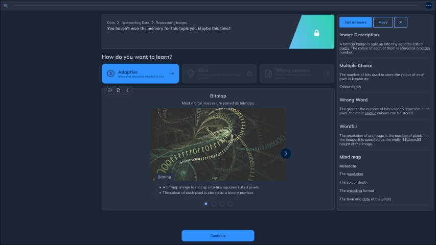

# Seneca Answers

Seneca Answers is an extension for Firefox and Chrome to get the answers to SenecaLearning lessons.




## Instalation

[](https://addons.mozilla.org/firefox/addon/seneca-answers/)
[](https://microsoftedge.microsoft.com/addons/detail/seneca-answers/bokkhhblppjnkonkllaccbneanfenncg)

### Manual installation

<details>
<summary>Firefox</summary>

Download `seneca-answers.xpi` from the latest [release](https://github.com/pepperonijail77/seneca-answers/releases/latest) - you will have to right-click and select `Save Link As...`, otherwise Firefox will try to install it.

Go to `about:debugging#/runtime/this-firefox`, and press `Load Temporary Add-on...`, then select the `seneca-answers.xpi` file that you downloaded.

</details>
<details>
<summary>Chrome</summary>

Download `seneca-answers.crx` from the latest [release](https://github.com/pepperonijail77/seneca-answers/releases/latest) - you will have to right-click and select `Save link as...`, otherwise Chrome will try to install it. Extract its contents into a folder somewhere.

On Chrome, go to `chrome://extensions`, and enable developer mode if you haven't already.

Press on `Load unpacked`, then navigate to and select the folder that you extracted into.

</details>
<details>
<summary>Other chromium</summary>

> Note that it is only tested on Firefox, Chrome and Chromium. There is no guarantee that it will work for your browser.

Download `seneca-answers.crx` from the latest [release](https://github.com/pepperonijail77/seneca-answers/releases/latest).

Go to `chrome://extensions`, and enable developer mode if you haven't already.

Drag and drop `seneca-answers.crx` that you downloaded onto the page, and press `Add Extension`.

</details>

## Usage

Simply go onto a lesson on [Seneca](https://app.senecalearning.com/), and you will see a pop-up on the right. Press `Get Answers` to get answers, drag `Move` to move the pop-up, and press `X` to hide the pop-up.

## Build

<details>
<summary>Prerequisites</summary>

- [git](https://git-scm.com/)
- [node.js](https://nodejs.org/)

Clone the repo.

```sh
git clone https://github.com/pepperonijail77/seneca-answers.git
```

In the root directory install all the npm dependencies.

```sh
npm install
```

</details>

In the root directory run build.js with node.js.

Firefox:

```sh
node build.js firefox
```

Chromium:

```sh
node build.js chrome
```

Both:

```sh
node build.js
```

The built files will be in `/dist`.

## License

This product is licensed under the [GNU GPL v3](https://choosealicense.com/licenses/gpl-3.0) License.
